# From 30% Cost Savings to Zero Downtime: Building a Centralized Cron Microservice

**TL;DR:** We were burning money on AWS RDS by storing 4,000-5,000 flight search results per international search, only to delete 99.9% of them later. With a 1000:1 search-to-booking ratio, we were essentially paying premium prices to store garbage. I built a centralized cron microservice that eliminated this waste, saved 30% on AWS costs, and improved performance. Here's the complete story.

## The Expensive Problem: When Analytics Costs More Than Revenue

Picture this: Every time someone searches for an international flight on ShareTrip, we generate 400-500 search results from multiple providers. Sounds normal, right? 

**Here's the crazy part:** We were storing ALL of them in AWS RDS. Every single search result. For analytics. 

### The Math That Made Everyone Cringe

```bash
# The brutal reality
1 international flight search = 400-500 results
Each result = Multiple table insertions (flights, segments, pricing, etc.)
Total DB operations per search = 4,000-5,000 inserts

# Our conversion rate
Search to booking ratio = 1000:1
Meaning: 999 out of 1000 searches never convert to bookings

# The waste
999 searches × 4,500 average inserts = 4.5 million pointless DB operations
All stored in expensive AWS RDS
All deleted by a cron job at end of day 🤦‍♂️
```

> **The Wake-Up Call:** Our AWS RDS bill was growing faster than our revenue. We were literally paying premium prices to store data we'd delete within 24 hours.

## The Legacy Architecture: A Masterclass in Inefficiency

### How It "Worked" Before

```mermaid
graph TD
    A[User Search] --> B[Generate 500 Results]
    B --> C[Insert ALL to RDS]
    C --> D[User Books 1 Flight]
    D --> E[Mark 1 Result as Booked]
    E --> F[End of Day Cron]
    F --> G[Extract Analytics from 499 Unbooked]
    G --> H[Update Analytics Table]
    H --> I[DELETE 499 Results]
    I --> J[💰 Money Burned]
```



### The Daily Waste Cycle

**Morning:** Fresh RDS, ready for action
```sql
-- Clean slate
SELECT COUNT(*) FROM flight_search_results; 
-- Result: 0
```

**Throughout the Day:** Accumulating expensive data
```sql
-- After 1000 searches
SELECT COUNT(*) FROM flight_search_results; 
-- Result: 4,500,000 rows (mostly garbage)
```

**End of Day Cron:** The expensive cleanup
```sql
-- The daily purge
DELETE FROM flight_search_results 
WHERE booking_id IS NULL; 
-- Deleted: 4,455,000 rows (99.9% of everything)

-- Update analytics
INSERT INTO search_analytics 
SELECT provider, route, count(*) 
FROM deleted_data;
```

**The Cost:** 
- RDS storage for millions of temporary rows
- Compute for massive INSERT operations
- Compute for massive DELETE operations  
- Network I/O for data that never mattered

## The Eureka Moment: Why Store What You'll Delete?

During our monolith-to-microservices migration, we introduced Redis caching for flight data. That's when it hit me:

> **"If we're already caching flights in Redis for performance, why are we also storing them in RDS for deletion?"**

### The New Vision

Instead of the expensive store-then-delete cycle:

1. **Cache search results in Redis** (we were already doing this)
2. **Extract analytics directly from Redis** (every 30 minutes)  
3. **Never touch RDS for temporary data** (revolutionary concept, apparently)
4. **Only store actual bookings in RDS** (you know, the data that matters)

The team's reaction: *"Why didn't we think of this sooner?"*

## Building the Centralized Cron Microservice

### The Architecture Decision

Instead of scattered cron jobs across different services, I proposed a **centralized cron microservice**:

```typescript
// The new architecture
@Injectable()
export class CronOrchestrator {
  private readonly jobs = new Map<string, CronJob>();
  
  constructor(
    private readonly redisService: RedisService,
    private readonly analyticsService: AnalyticsService,
    private readonly logger: Logger
  ) {}

  @Cron('*/30 * * * *') // Every 30 minutes
  async processFlightAnalytics() {
    await this.extractAnalyticsFromRedis();
    await this.cleanupProcessedData();
  }
}
```

### Why Centralized Cron Jobs?

**Before: Distributed Chaos**
- Flight service had its cleanup cron
- Booking service had its reminder cron  
- Payment service had its reconciliation cron
- Each service managing its own schedule
- No visibility into job execution
- Failures went unnoticed

**After: Orchestrated Efficiency**
- Single service manages all scheduled tasks
- Centralized logging and monitoring
- Easy to scale and manage
- Clear dependency management
- Failure visibility and alerting

## The Implementation: Smart Caching Strategy

### Step 1: Redis-First Analytics Collection

```typescript
@Injectable()
export class FlightAnalyticsProcessor {
  
  async extractAnalyticsFromRedis(): Promise<void> {
    const searchKeys = await this.redis.keys('flight_search:*');
    const analyticsData = new Map<string, SearchMetrics>();
    
    for (const key of searchKeys) {
      const searchData = await this.redis.get(key);
      const flightData = JSON.parse(searchData);
      
      // Extract analytics without touching RDS
      this.aggregateMetrics(flightData, analyticsData);
    }
    
    // Bulk update analytics table
    await this.updateAnalyticsTable(analyticsData);
    
    // Clean up processed Redis data
    await this.cleanupRedisData(searchKeys);
  }
  
  private aggregateMetrics(flightData: any, metrics: Map<string, SearchMetrics>) {
    const key = `${flightData.provider}_${flightData.route}`;
    const existing = metrics.get(key) || new SearchMetrics();
    
    existing.searchCount++;
    existing.averagePrice = this.calculateAverage(existing, flightData.price);
    existing.popularTimes.push(flightData.searchTime);
    
    metrics.set(key, existing);
  }
}
```

### Step 2: Intelligent Data Lifecycle

```typescript
// The new flow - no more RDS waste
class FlightSearchService {
  
  async searchFlights(criteria: SearchCriteria): Promise<FlightResult[]> {
    const searchId = generateSearchId();
    const results = await this.aggregateFromProviders(criteria);
    
    // Store in Redis with TTL (not RDS!)
    await this.redis.setex(
      `flight_search:${searchId}`, 
      3600, // 1 hour TTL
      JSON.stringify({
        searchId,
        criteria,
        results,
        timestamp: new Date(),
        provider: 'multiple'
      })
    );
    
    return results;
  }
  
  async bookFlight(searchId: string, flightId: string): Promise<Booking> {
    // Only NOW do we touch RDS
    const searchData = await this.redis.get(`flight_search:${searchId}`);
    const selectedFlight = this.findFlightById(searchData, flightId);
    
    // Store the actual booking (permanent data)
    const booking = await this.bookingRepository.save({
      ...selectedFlight,
      bookingId: generateBookingId(),
      status: 'confirmed'
    });
    
    return booking;
  }
}
```

## The Results: Numbers That Made Everyone Happy

### Cost Optimization Breakdown

**Before the Microservice:**
```bash
Daily RDS Operations:
- Inserts: 4.5M rows/day × $0.0001/operation = $450/day
- Storage: 4.5M rows × 2KB × $0.023/GB/month = $207/month  
- Deletes: 4.45M rows/day × $0.0001/operation = $445/day
- Network I/O: ~50GB/day × $0.01/GB = $0.50/day

Monthly RDS Cost: ~$27,000
```

**After the Microservice:**
```bash
Daily Operations:
- Redis operations: 4.5M × $0.000001 = $4.50/day
- Analytics inserts: ~1000 rows/day × $0.0001 = $0.10/day  
- Booking inserts: ~4.5 rows/day × $0.0001 = $0.0005/day
- Redis storage: 50GB × $0.02/GB = $1.00/day

Monthly Cost: ~$18,900
Savings: $8,100/month (30% reduction!)
```

### Performance Improvements

**🚀 Speed Gains:**
- Search response time: 2.8s → 1.9s (32% faster)
- Analytics processing: 45 minutes → 2 minutes (95% faster)
- End-of-day cleanup: 2 hours → 5 minutes (96% faster)

**📊 Operational Benefits:**
- Zero downtime during migration
- Reduced RDS load by 90%
- Eliminated daily cleanup bottlenecks
- Improved monitoring and alerting

## The Technical Deep Dive: Microservice Architecture

### Service Structure

```typescript
// Centralized cron microservice structure
src/
├── cron/
│   ├── cron.controller.ts      # Health checks and manual triggers
│   ├── cron.service.ts         # Job orchestration
│   └── jobs/
│       ├── flight-analytics.job.ts
│       ├── booking-reminders.job.ts
│       └── payment-reconciliation.job.ts
├── processors/
│   ├── analytics.processor.ts   # Redis → Analytics logic
│   ├── cleanup.processor.ts     # Data lifecycle management
│   └── notification.processor.ts
└── shared/
    ├── redis.service.ts
    ├── monitoring.service.ts
    └── types/
```

### Scalability Features

```typescript
@Injectable()
export class ScalableCronService {
  
  // Distributed job execution
  @Cron('*/30 * * * *')
  async processAnalytics() {
    const jobId = `analytics_${Date.now()}`;
    
    // Prevent duplicate execution across instances
    const lock = await this.redis.setnx(`job_lock:${jobId}`, 'locked');
    if (!lock) {
      this.logger.log('Job already running on another instance');
      return;
    }
    
    try {
      await this.executeAnalyticsJob(jobId);
    } finally {
      await this.redis.del(`job_lock:${jobId}`);
    }
  }
  
  // Batch processing for large datasets
  async executeAnalyticsJob(jobId: string) {
    const batchSize = 1000;
    let processed = 0;
    
    while (true) {
      const batch = await this.getNextBatch(processed, batchSize);
      if (batch.length === 0) break;
      
      await this.processBatch(batch);
      processed += batch.length;
      
      // Progress tracking
      await this.updateJobProgress(jobId, processed);
    }
  }
}
```

## Challenges and Solutions

### Challenge 1: Data Consistency During Migration

**Problem:** How do we migrate without losing data or breaking analytics?

**Solution:** Dual-write pattern with gradual migration
```typescript
// Transition period - write to both systems
async storeSearchResults(data: SearchData) {
  // New way (Redis)
  await this.redis.setex(`flight_search:${data.id}`, 3600, JSON.stringify(data));
  
  // Old way (RDS) - during migration only
  if (this.config.MIGRATION_MODE) {
    await this.legacyRepository.save(data);
  }
}
```

### Challenge 2: Redis Memory Management

**Problem:** Redis running out of memory with large datasets

**Solution:** Smart TTL and data compression
```typescript
// Intelligent data lifecycle
async storeWithSmartTTL(key: string, data: any) {
  const compressed = this.compressData(data);
  const ttl = this.calculateOptimalTTL(data.type);
  
  await this.redis.setex(key, ttl, compressed);
  
  // Monitor memory usage
  const memoryUsage = await this.redis.memory('usage', key);
  if (memoryUsage > this.config.MAX_KEY_SIZE) {
    await this.archiveToS3(key, data);
    await this.redis.del(key);
  }
}
```

### Challenge 3: Monitoring and Observability

**Problem:** How do we know if cron jobs are working properly?

**Solution:** Comprehensive monitoring with Grafana dashboards
```typescript
@Injectable()
export class CronMonitoringService {
  
  async recordJobExecution(jobName: string, duration: number, status: 'success' | 'failed') {
    // Metrics for Grafana
    this.metricsService.histogram('cron_job_duration', duration, { job: jobName });
    this.metricsService.counter('cron_job_executions', 1, { job: jobName, status });
    
    // Alerting
    if (status === 'failed') {
      await this.alertingService.sendAlert({
        severity: 'high',
        message: `Cron job ${jobName} failed`,
        duration
      });
    }
  }
}
```

## The Team Impact: Beyond Cost Savings

### Developer Experience Improvements

**Before:** 
- "The analytics cron failed again" 😤
- "Why is RDS so slow today?" 🐌
- "We're over budget on AWS again" 💸

**After:**
- "Analytics are updating every 30 minutes automatically" ✅
- "RDS performance is consistently good" 🚀  
- "We're under budget with better performance" 💰

### Operational Excellence

```bash
# Monitoring dashboard metrics
Cron Job Success Rate: 99.8%
Average Job Duration: 2.3 minutes (down from 45 minutes)
Failed Jobs This Month: 2 (down from 45)
Cost per Analytics Update: $0.02 (down from $12.50)
```

## Lessons Learned: Architecture Wisdom

### 1. Question the Status Quo
Just because "we've always done it this way" doesn't mean it's right. Sometimes the biggest improvements come from asking "why are we doing this?"

### 2. Cache-First Thinking
If you're already caching data for performance, consider using that cache for other purposes too. Don't duplicate storage unnecessarily.

### 3. Centralized vs Distributed
Centralized cron management provides better visibility and control than scattered job scheduling across services.

### 4. Measure Everything
Without metrics, you can't prove improvements. Track costs, performance, and reliability before and after changes.

### 5. Migration Strategy Matters
Dual-write patterns and gradual migration reduce risk when changing critical data flows.

## What's Next: Future Improvements

I'm working on v2 of the cron microservice with:

- **AI-powered job scheduling** - Optimize timing based on system load
- **Cross-region job distribution** - Better resilience and performance
- **Dynamic scaling** - Auto-scale based on workload
- **Advanced analytics** - Predictive insights on data patterns
- **Integration with Kubernetes CronJobs** - Cloud-native scheduling

## The Technical Takeaway

This wasn't just about saving money - it was about building smarter systems. The key insights:

1. **Data lifecycle thinking** - Not all data needs permanent storage
2. **Cache optimization** - Use Redis for more than just performance
3. **Centralized orchestration** - Better than distributed chaos
4. **Cost-conscious architecture** - Every database operation has a price
5. **Monitoring-first design** - Observability isn't optional

## Try This Approach

If you're dealing with:
- High AWS RDS costs from temporary data
- Scattered cron jobs across services
- Analytics processing bottlenecks
- Poor visibility into scheduled tasks

Consider the centralized cron microservice pattern. Start small:

1. **Audit your current cron jobs** - What's running where?
2. **Identify wasteful data patterns** - What gets stored then deleted?
3. **Leverage existing caches** - Can Redis do double duty?
4. **Build monitoring first** - You need visibility
5. **Migrate gradually** - Dual-write during transition

---

**The Bottom Line:** Sometimes the best optimization isn't making things faster - it's eliminating unnecessary work entirely. We saved 30% on AWS costs not by optimizing database queries, but by questioning why we were using the database at all.

*Building cost-effective architectures? I'd love to hear about your optimization strategies. Connect with me on [LinkedIn](https://linkedin.com/in/mahabubarafat) - let's discuss smart architecture patterns and cost optimization techniques.*
